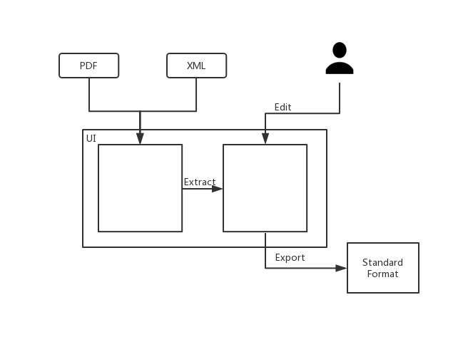
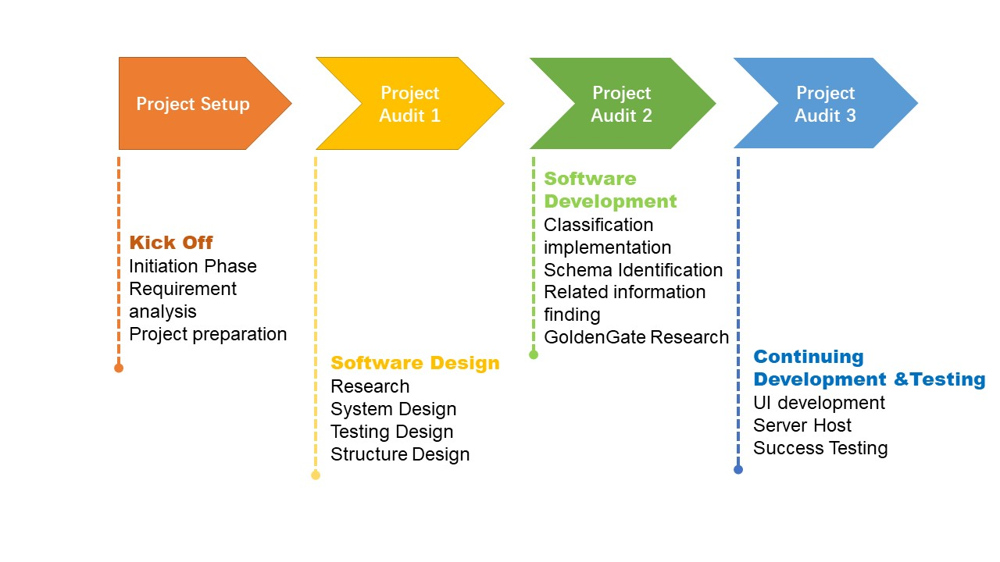
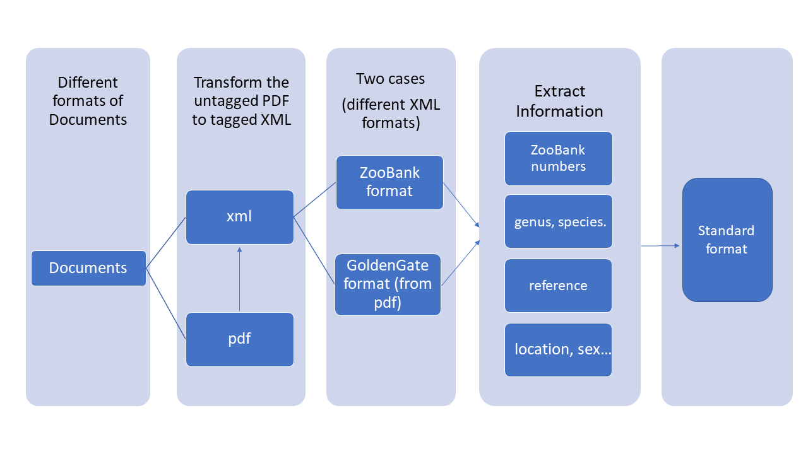
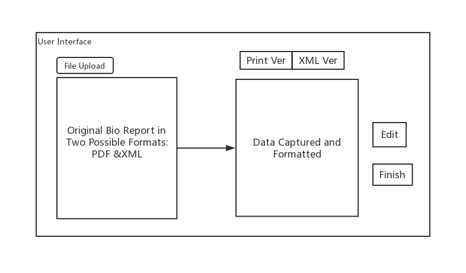
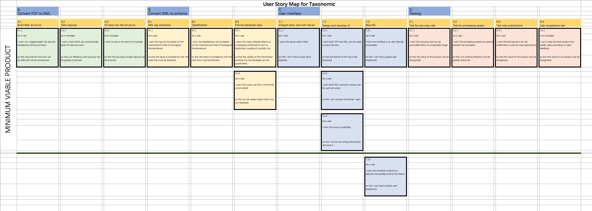
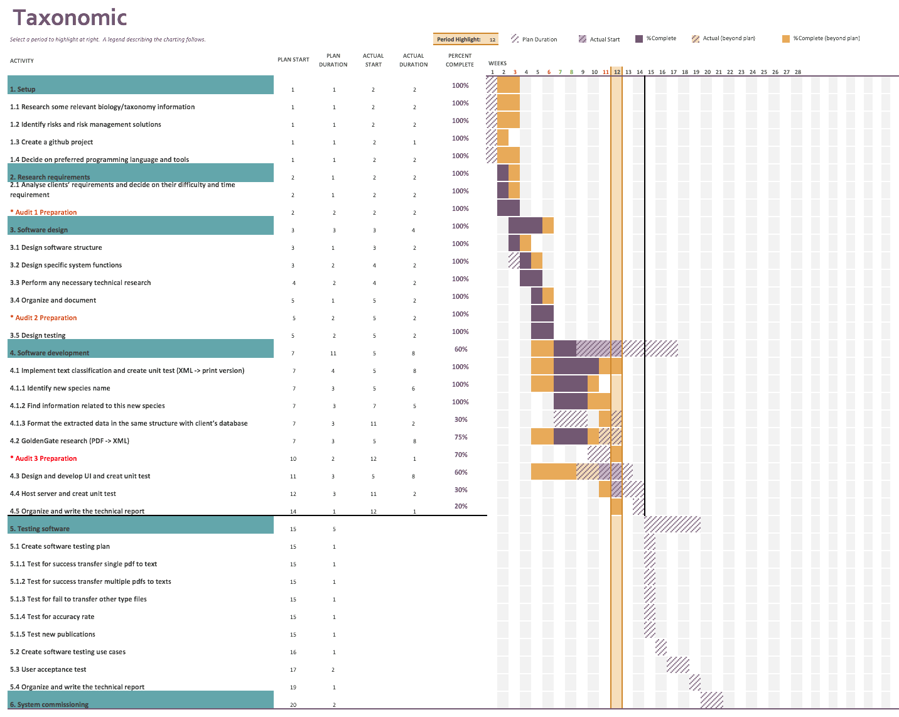
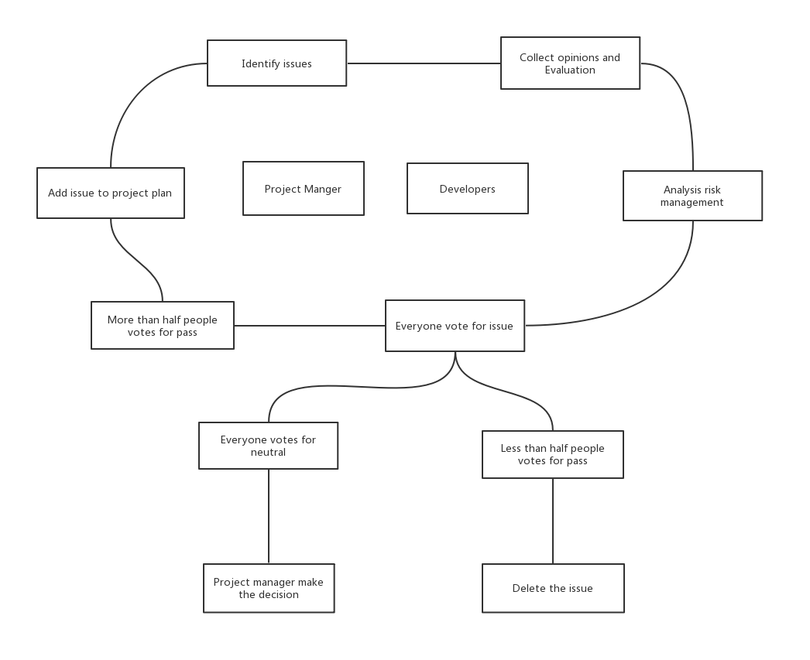

Table of Contents
=================
  * [Introduction](#introduction)
  * [Project Value](#project-value)
  * [Client Expectation](#client-expectation)
  * [Road Map and System Diagram](#road-map-and-system-diagram)
  * [User Interface Prototype](#user-interface-prototype)
  * [User Story Map](#user-story-map)
  * [Milestones](#milestones)
  * [Schedule](#schedule)
  * [Progress](#progress)
  * [Risk Management](#risk-management)
  * [Team Member Roles](#team-member-roles)
  * [Communiaction Tools](#communication-tools)
  * [Development Environment](#development-environment)
  * [Development Tools](#development-tools)
  * [Decision Make Procedures](#decision-make-procedures)
  * [Testing](#testing)
  * [Meeting Agendas](#meeting-agendas)
  * [Audit Presentation](#audit-presentation)
  * [Other Resources](#other-resources)
## Introduction
Our project aims to automate taxonomic data capture from scientific reports, something which is currently performed manually. This information can then be uploaded to searchable databases where it can be accessed by the public. Automating this process will save our client time, effort and money which can be better spent elsewhere.
# 
## Project Value
Having a comprehensive database of taxa data is useful to those studying biology as they can easily search the database to find relevant materials describing the taxa they are studying. These biological studies can help with sustainable management of biodiversity, conservation/protection of species, biosecurity, management of invasive species and much more. Our project will build an web-based automatic data collection application. Therefore, it can improve the data collection efficiency for Australian Biological Resources Study(ABRS), optimise extraction accuracy, reduce their labor consumption and save a lot of money.  

## Client Expectation
The client expects us to achieve functionality in terms of analysing documents in pdf or xml form and returning taxonomic information in a straightforward format, which the client is then able to check, edit. The program should be intuitive, accurate and time-saving.

## Road Map and System Diagram
# 
# 
## User Interface Prototype
# 
## User Story Map
# 
## Milestones
General:
- CSV output
- Passed user acceptance testing

UI:
- Highlighting input
- Well formatted output
- Editable output

PDF:
- Acceptable level of name border recognition
- Reference parsing
- Field association (connecting relevant information)
- Independent (no reliance on webservices)

XML:
- Changing output format to csv.
- Adding and changing output fields according to clients’ requirement.
- Testing more cases from Zookey, and other publishers’ articles who also use TaxPub xml structure. Make improvements on the  extraction accuracy.
- Analysing and report on the failure situation.

Server:
- Getting contact with ANU to know if we could establish a server in ANU.
- Studying informations about other platforms where we could implement server, such as Herok.
- Learning server knowledges and give a break-down plan of implementation.

Testing:
- Main function testing
- Client acceptance testing
- User's manual

## Schedule
Weeks 2-3:
- Re-establish communication with client
- Create plan for the semester
- Update necessary documentation
- Prepare for audit

Weeks 4-5:
- Improve UI (output display)
- Change output format to csv
- Work on parsing bibliography references
- Try to reduce reliance on webservers

Weeks 5-6:
- Improve UI (editable input)
- Attempt to increase "border word" list / Integrate other name detection (PDF)
- Add some holotype/coordinate detection (PDF)
- Prepare for audit

Week 7-8:
- Try to link different attributes within text (eg genders with holotypes, holotypes with species) (PDF)
- Improve UI (Highlighting relevant input text)

Week 9-10:
- Testing with client
- Acting on client feedback
- Prepare for audit

Week 11-12:
- Finalising project
- User acceptance testing

## Progress
# 

Semester 1

Audit 1:
- Researched relevant biology/taxonomy information
- Indentified risks.
- Created a github project.
- Communicated with clients, find the problem, underlying needs.

Audit 2:
- Created the general structure of the project and the structure of each part (frontend, backend, UI, testing).
- Made statement of work (SOW).
- Allocated tasks and roles according to the SOW.
- Created UI prototype.
- Started research GoldenGate.
- Implemented basic functions to identify new species name and genus name in the abstract of XML formatted article.

Audit 3:
- Communicated with clients about the output schema, updating clients’ needs.
-	Designed poster.
-	Finished the research about GoldenGate, started using NLP to process PDF articles.
-	Found other taxonomic information related with new species/genus, agents and reference in XML articles, matching. 
-	Formatted the extracted the extracted data as clients’ needs.
-	Used flask (a micro web framework written in Python) to connect with backend.
-	Wrote unit test.

Semester 2

Audit 1:

# Risk Management
As the project is being implemented as part of a secure system, it is important that it does not present any new vulnerabilities to that system. This can be achieved by being considerate of the environment in which our project will be deployed and using appropriate programming techniques.
#### [Risk Register](https://drive.google.com/open?id=1G4hapzQhnL0GRmlryVrjvmWTVhTzQFFp)
## Team Member Roles

| Team Member            | Uni ID         | Role                                                                    |
| -----------------------| ---------------| ------------------------------------------------------------------------|
| Jing Li                | u6531952       | Project Manager, Developer(XML extraction)                              |
| Biwei Cao              | u5926643       | Developer(XML extraction), Documentation                                |
| Jiaqi Zhang            | u6089193       | Developer(Testing)                                                      |
| Joshua Trevor          | u6405233       | Developer(PDF extraction), Spokesperson                                 |
| Yanlong LI             | u5890571       | Developer(full stack)                                                   |
| Yuan Yao               | u5945391       | Developer(data interaction), Documentation                              |

## Communication Tools
1. Email
2. Facebook Messenger

## Development Environment
-  Language: 
  - Backend is written in python
  - Frontend uses HTML, CSS and JavaScript
-  Testing: 
   -  Unit test during development by black/white box
   -  A/B test for the final stage 

## Development Tools
1. PyCharm(Python IDE)
2. Flask(A micro web framework)
3. DreamWeaver(HTML, CSS, JavaScript)

## Decision Make Procedures
# 
#### [Decision Making Log](https://drive.google.com/drive/folders/1b3dv2sz7afSjeyFnS2Lp_9u7vdMrBOAC?usp=sharing)

## Testing
1. #### [Testing Design](https://docs.google.com/document/d/1Ds8spftVot8HpBYaTwZCm5_Jucjr2VzA0EnykC7GGcU/edit)
2. #### [Testing Plan](https://docs.google.com/document/d/1BsLx-H9nUd1ptGQ386oEkVbimc8xFrDpF3hfXgGit60/edit)
3. #### [Testing Methods](https://docs.google.com/document/d/1QbspjZKj_AQi0iJRnJDsckxD-U5ubWqwHPQPurHizXM/edit)
4. Testing Process
# .png)
5. #### [Testing Results](https://docs.google.com/document/d/1p2bCQ_or1BENsoTOsLfLFjsNcGDdl9NSF6bJGyYsgVE/edit)

## Meeting Agendas
#### [Client Meeting](https://drive.google.com/drive/folders/15L1_3DY4wlhsUmIWcp4z-ChY9mvAJCHK?usp=sharing)
#### [Group Meeting](https://drive.google.com/drive/folders/1vdle7ZXXMmjaULrHACn98w_xWHsLXNkG?usp=sharing)

## Audit Presentation
#### [Audit1 (Semester2)](https://docs.google.com/presentation/d/1KFPRAI61264166AXwdHr-oGo2_7Cn2nEl4v1HEd7xIs/edit#slide=id.p)

## Other Resources
#### [Google Drive S2](https://drive.google.com/drive/folders/1z85XNqG6v9YqrcAm98RzeaTmDYXoyPEj)
#### [Old Google Drive](https://drive.google.com/open?id=1827uZfi0IwiuHkuLUU6tcL8gX5F0Jx0d)
