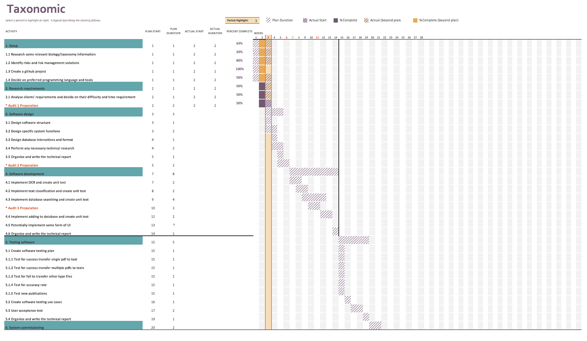

Table of Contents
=================
  * [Introduction](#introduction)
  * [Client Expectation](#client-expectation)
  * [System Diagram](#system-diagram)
  * [Milestones](#milestones)
  * [Schedule](#schedule)
  * [Risk Management](#risk-management)
  * [Team Member Roles](#team-member-roles)
  * [Meeting Agenda](#meeting-agenda)
  * [Resources](#resources)
## Introduction
Our project aims to automate taxonomic data capture from scientific reports, something which is currently performed manually. This information can then be uploaded to searchable databases where it can be accessed by the public. Automating this process will save our client time, effort and money which can be better spent elsewhere.
## Product Value
Our project has high academic and economic value. The project will help our clients improve their data collection efficiency, which can save a lot of time for them. Also, the project output software is working on automatic data collection. Therefore, they can reduce labor consumption and save a lot of money. In addition, this project is working for an open source academic website, the success of our project will help many people improve their data searching speed on this web site.
## Client Expectation 
The client expects us to achieve some sort of functionality in terms of analysing documents in pdf form and returning scientific names present. At this point the client's expectations are not entirely clear and we intend to work with them to develop a concrete idea of what we are supposed to achieve with our project over the course of this week.
## System Diagram
# 
## Milestones
- Complete description of project objectives and requirements compiled
- Systems design finalised
- Functional OCR implemented (PDF to text)
- Text classification reached functional level
- Database search through API implemented
- Text classification works well
- Database upload through API implemented
- System passes testing
## Schedule
At present, we can only make the plan for this semester (week 1 to week 14, week 7 and week 8 are the mid-term holidays). 
In the next semester, we will continue the unfinished work of this semester and do testing. Whether to do the front-end part will be based on the progress of this semester and the communication with our client.
# 
1. Setup( 1 week):
- Research some relevant biology/taxonomy information
- Identify risks and risk management solutions
- Create a github project
- Decide on preferred programming language and tools
2. Research requirements(1 week):
- Analyse clients’ requirements and decide on their difficulty and time requirement
3. Software design( 2 - 3 weeks):
- Design software structure
- Design specific system functions
- Design database interactions and format
- Perform any necessary technical research 
4. Software development( 6 - 8 weeks):
-	Implement OCR and create unit test
-	Implement text classification and create unit test
-	Implement database searching and create unit test
-	Implement adding to database and create unit test
-	Potentially implement some form of UI 

5. Testing software(  3 weeks):
- Create software testing plan
  * Test for success transfer single pdf to text; 
  *	Test for success transfer multiple pdfs to texts;
  * Test for fail to transfer other type files;
  * Test for correctly extracting information from the one text, compared with the already manually classified publications from the clients;
  *	Test new publications.
- Create software testing use cases
- Implement software testing methods
- User Acceptance Testing
6. System commissioning( 2 weeks):
7. Documentation and Audit Preparation (6 weeks)
- Finalise documentation for design, development and testing
## Risk Management
As the project is being implemented as part of a secure system, it is important that it does not present any new vulnerabilities to that system. This can be achieved by being considerate of the environment in which our project will be deployed and using appropriate programming techniques.
#### [Risk Register](https://drive.google.com/drive/folders/1VyUxQys5N7-MRKLpOc4DQ5fEEyYf8H6q?usp=sharing)
## Team Member Roles

| Team Member            | Uni ID         | Role                            |
| -----------------------| ---------------| --------------------------------|
| Jing Li                | u6531952       | Project Manager                 |
| Biwei Cao              | u5926643       | Developer, Documentation (Agenda)|
| Jiaqi Zhang            | u6089193       | Developer                       |
| Joshua Trevor          | u6405233       | Developer, Spokesperson         |
| Yanlong LI             | u5890571       | Developer                       |
| Yuan Yao               | u5945391       | Developer, Documentation        |

## Communication tool
1. Gmail
2. Messenger
3. Facebook

## Development tool
1. PyCharm(Python IDE)
2. WebStorm(JavaScript)
3. MySQL(Database)
4. DreamWeaver(HTML, CSS, JavaScript)
## Meeting Agenda
#### [Client Meeting](https://drive.google.com/drive/folders/1mm_xKNJ9t8DZAf-LZkJD0TDQlAKYAVky?usp=sharing)
#### [Group Meeting](https://drive.google.com/drive/folders/1MDCKulVX2guaDb-cfK7kPHIie3Kgz8MA?usp=sharing)

## Resources
#### [Google Drive](https://drive.google.com/open?id=1827uZfi0IwiuHkuLUU6tcL8gX5F0Jx0d)

